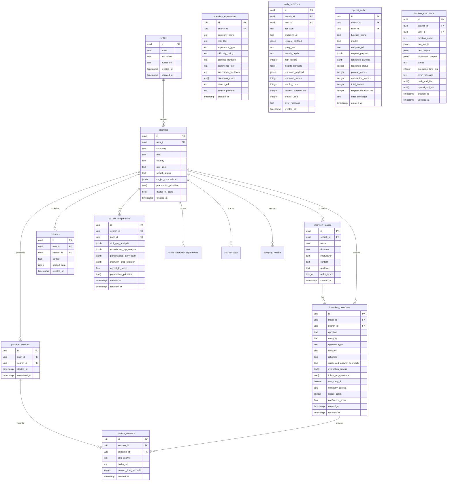

# Technical Design Document: Hireo - Interview Prep Tool

## Table of Contents
1. [System Architecture Overview](#1-system-architecture-overview)
2. [Database Schema](#2-database-schema)
3. [API Design](#3-api-design)
4. [Authentication Architecture](#4-authentication-architecture)
5. [Component Architecture](#5-component-architecture)
6. [State Management Strategy](#6-state-management-strategy)
7. [Design System](#7-design-system)
8. [Real-time Features](#8-real-time-features)
9. [Error Handling Strategy](#9-error-handling-strategy)
10. [Security Architecture](#10-security-architecture)
11. [Performance Optimization](#11-performance-optimization)
12. [Development Environment](#12-development-environment)
13. [Testing Strategy](#13-testing-strategy)
14. [Scalability Considerations](#14-scalability-considerations)
15. [Risk Mitigation](#15-risk-mitigation)
16. [Quick Reference](#16-quick-reference)

## 1. System Architecture Overview

### 1.1 High-Level Architecture

```
┌─────────────────┐    ┌──────────────────┐    ┌─────────────────┐
│   React Client  │    │  Supabase Stack  │    │  OpenAI API     │
│                 │    │                  │    │                 │
│ • React + Vite  │◄──►│ • PostgreSQL     │    │ • GPT-4o        │
│ • TypeScript    │    │ • Auth           │◄──►│ • Deep Research │
│ • Tailwind CSS  │    │ • Edge Functions │    │ • Completions   │
│ • shadcn/ui     │    │ • Storage        │    │                 │
└─────────────────┘    └──────────────────┘    └─────────────────┘
```

### 1.2 Technology Stack

#### Frontend
- **Framework:** React 18 with TypeScript
- **Build Tool:** Vite for fast development and optimized builds
- **Styling:** Tailwind CSS with custom design system
- **UI Components:** shadcn/ui for consistent, accessible components
- **State Management:** React Context for auth, React Query for server state
- **Routing:** React Router v6 for client-side navigation

#### Backend
- **Database:** Supabase PostgreSQL with Row Level Security (RLS)
- **Authentication:** Supabase Auth (email/password)
- **API Layer:** Supabase Edge Functions (Deno runtime)
- **File Storage:** Supabase Storage for CV uploads (future)

#### External Services
- **AI Research:** OpenAI API (GPT-4o) with JSON mode for reliable parsing
- **Internet Research:** Tavily API with **DuckDuckGo fallback** for multi-engine search reliability
- **Enhanced Processing:** Concurrent execution patterns inspired by Aston AI Research Tool
- **Deployment:** Lovable hosting platform

### 1.3 Key Design Decisions

#### Why Supabase Over Custom Backend?
- **Rapid Development:** Built-in auth, real-time, and database
- **Row Level Security:** Database-level access control
- **Edge Functions:** Serverless API endpoints with global distribution
- **Type Generation:** Automatic TypeScript types from schema

#### Why shadcn/ui Over Other UI Libraries?
- **Accessibility First:** Built on Radix UI primitives
- **Customizable:** Copy-paste approach allows full customization
- **TypeScript Native:** Excellent type safety and developer experience
- **Design System:** Consistent variant system with CVA

## 2. Database Schema

> **📋 Complete Schema Documentation**: See [Optimized Database Schema](./OPTIMIZED_DATABASE_SCHEMA.md) for the full hybrid scraping schema documentation.

### 2.1 Hybrid Scraping Architecture

The database has been completely optimized for **hybrid native + Tavily scraping** approach:

#### **Key Improvements:**
- ✅ **Native scraping tables** for structured forum data (Glassdoor, Reddit, Blind, LeetCode)
- ✅ **Quality scoring system** with automated content assessment  
- ✅ **Cost optimization** through intelligent URL deduplication and caching
- ✅ **Performance indexes** for sub-second query response times
- ✅ **Real-time analytics** for scraping performance monitoring

#### **Core New Tables:**
- `native_interview_experiences` - Structured forum experiences with metadata
- `api_call_logs` - Unified logging for all API providers (Tavily, Reddit, OpenAI)  
- `scraping_metrics` - Real-time performance and quality analytics
- Enhanced `scraped_urls` - Native source tracking and quality scoring

### 2.2 Entity Relationship Diagram



### 2.2 Table Specifications

#### Core Workflow Tables

##### profiles
- **Purpose:** Store user profile information with auto-creation trigger
- **RLS Policies:** Users can view/update their own profile only
- **Indexes:** Primary key on id, unique on email

##### searches
- **Purpose:** Track user search queries and aggregated results
- **Status Flow:** `pending` → `processing` → `completed` | `failed`
- **Enhanced Data:** Stores final processed results from all functions
- **RLS Policies:** Users can create/view their own searches only

##### interview_stages & interview_questions
- **Purpose:** Store structured interview process and questions
- **Generation:** AI-generated during search processing
- **RLS Policies:** Users can view data for their searches only

##### resumes
- **Purpose:** Store user CVs with parsed data (cleaned up - no redundant columns)
- **Structure:** Only essential fields: id, user_id, search_id, content, parsed_data, created_at
- **Parsing:** All structured data stored in `parsed_data` JSONB field

#### Enhanced Data Tables

##### cv_job_comparisons
- **Purpose:** Store detailed CV-job fit analysis results
- **Data:** Skill gaps, experience analysis, preparation strategies

##### interview_questions (Enhanced)
- **Purpose:** Store comprehensive interview questions with rich metadata
- **Categories:** Behavioral, technical, situational, company-specific, role-specific, experience-based, cultural-fit
- **Metadata:** Difficulty, rationale, answer guidance, evaluation criteria, follow-up questions
- **Features:** Company context, STAR method compatibility, confidence scoring

##### interview_experiences
- **Purpose:** Store research data from interview experiences
- **Sources:** Glassdoor, Reddit, LinkedIn, etc.

#### Comprehensive Logging Tables

##### tavily_searches
- **Purpose:** Log ALL Tavily API calls (search/extract) with full audit trail
- **Data:** Complete request/response payloads, performance metrics, cost tracking
- **Benefits:** Cost monitoring, debugging, reprocessing capability

##### openai_calls
- **Purpose:** Log ALL OpenAI API calls with token usage tracking
- **Data:** Full request/response, token counts, cost calculation
- **Benefits:** Cost optimization, performance monitoring

##### function_executions
- **Purpose:** Log complete function executions with raw and processed data
- **Data:** Raw inputs, raw API responses, final processed outputs
- **Benefits:** Complete audit trail, debugging, data reprocessing

### 2.3 Data Flow Architecture

```
User Input → Function Execution → Multiple API Calls → Raw Data Storage → Processed Results
     ↓              ↓                    ↓                   ↓                 ↓
  searches    function_executions   tavily_searches    raw_outputs      final tables
                                   openai_calls       raw_inputs       (cv_job_comparisons,
                                                                       enhanced_question_banks)
```

### 2.4 Logging & Audit Trail Strategy

- **Complete API Coverage:** Every external API call logged
- **Cost Tracking:** Real-time monitoring of Tavily credits and OpenAI tokens
- **Performance Metrics:** Response times, success rates, error tracking
- **Data Preservation:** Raw API responses stored for reprocessing
- **Debugging Support:** Full request/response history for troubleshooting

## 3. API Design - Microservices Architecture

### 3.1 Overview

The INT application uses a microservices architecture with four specialized Edge Functions:

```
┌─────────────────┐    ┌──────────────────┐    ┌─────────────────┐
│   cv-analysis   │    │ company-research │    │  job-analysis   │
│                 │    │                  │    │                 │
│ • CV parsing    │    │ • Tavily search  │    │ • URL extraction│
│ • AI analysis   │    │ • Company data   │    │ • Requirements  │
│ • Skills extract│    │ • Culture info   │    │ • Analysis      │
└─────────────────┘    └──────────────────┘    └─────────────────┘
        │                       │                       │
        └───────────────────────┼───────────────────────┘
                                │
                    ┌──────────────────┐
                    │interview-research│
                    │                  │
                    │ • Orchestrator   │
                    │ • AI synthesis   │
                    │ • Final outputs  │
                    └──────────────────┘
```

### 3.2 Edge Function: cv-analysis

#### Endpoint
`POST /functions/v1/cv-analysis`

#### Purpose
Independent CV parsing and analysis using AI.

#### Request Schema
```typescript
interface CVAnalysisRequest {
  cvText: string;
  userId: string;
}
```

#### Response Schema
```typescript
interface CVAnalysisResponse {
  success: boolean;
  parsedData: ProfileParsedData;
  aiAnalysis: CVAnalysis;
}
```

#### Processing Flow
1. **AI Analysis**: Uses LLM for CV parsing
2. **Skill Categorization**: Intelligent extraction by type
3. **Data Transformation**: Converts to UI-compatible format
4. **Return Results**: Both raw analysis and formatted data

### 3.3 Edge Function: company-research (Enhanced)

#### Endpoint
`POST /functions/v1/company-research`

#### Purpose
**Real candidate experience research** using enhanced Tavily API integration with deep content extraction.

#### Request Schema
```typescript
interface CompanyResearchRequest {
  company: string;
  role?: string;
  country?: string;
  searchId: string;
}
```

#### Response Schema
```typescript
interface CompanyResearchResponse {
  status: "success" | "error";
  company_insights: CompanyInsights;
  research_sources: number;
  extracted_urls: number;
  deep_extracts: number;
}
```

#### Enhanced Processing Flow (Retrieve-then-Extract Pattern)

**Phase 1: Discovery Searches (12 targeted queries)**
- Glassdoor interview pages: `site:glassdoor.com/Interview`
- Blind boards with company tickers: `AMZN interview`, `GOOGL interview`  
- 1point3acres for international: `interview 面试`
- Role-specific recent searches: `2024 2025`
- Raw content enabled: `include_raw_content: true`

**Phase 2: Deep Content Extraction**
- Extract URLs from discovery results
- Tavily `/extract` API for full page content (4-6k chars vs 200 char snippets)
- Focus on interview review sites (Glassdoor, Blind, 1point3acres, Reddit)
- Process up to 15 URLs for comprehensive data

**Phase 3: AI Analysis with Real Data**
- JSON mode: `response_format: { type: "json_object" }`
- Extract interview stages from actual candidate reports
- Process raw content from interview reviews
- Generate structured insights based on real experiences

#### Key Improvements
- **Real Data**: Actual candidate experiences vs LLM speculation
- **Better Targeting**: Company ticker symbols, role-specific queries
- **Deeper Analysis**: 4-6k characters per source vs previous 200 chars
- **Reliability**: JSON mode prevents parsing errors

### 3.4 Edge Function: job-analysis

#### Endpoint
`POST /functions/v1/job-analysis`

#### Purpose
Extract and analyze job requirements from URLs.

#### Request Schema
```typescript
interface JobAnalysisRequest {
  roleLinks: string[];
  searchId: string;
  company?: string;
  role?: string;
}
```

#### Response Schema
```typescript
interface JobAnalysisResponse {
  status: "success" | "error";
  job_requirements: JobRequirements;
  urls_processed: number;
}
```

#### Processing Flow
1. **URL Extraction**: Tavily extract from job posting URLs
2. **AI Analysis**: Extract structured requirements
3. **Return Data**: Skills, qualifications, responsibilities

### 3.5 Edge Function: interview-research (Orchestrator)

#### Endpoint
`POST /functions/v1/interview-research`

#### Purpose
**Synthesis orchestrator** that generates all final user outputs.

#### Request Schema
```typescript
interface SynthesisRequest {
  company: string;
  role?: string;
  country?: string;
  roleLinks?: string[];
  cv?: string;
  userId: string;
  searchId: string;
}
```

#### Response Schema
```typescript
interface SynthesisResponse {
  status: "success" | "error";
  message: string;
  insights: {
    company_data_found: boolean;
    job_data_found: boolean;
    cv_analyzed: boolean;
    stages_created: number;
    personalized_guidance: PersonalizedGuidance;
  };
}
```

#### Processing Flow
1. **Data Gathering**: Call other microservices in parallel
2. **AI Synthesis**: Generate personalized interview guidance
3. **Database Storage**: Store stages, questions, guidance
4. **Status Update**: Mark search as completed

#### Final Outputs Generated
- **Interview Stages**: Company-specific process breakdown
- **Targeted Questions**: 4-6 questions per stage
- **Personalized Guidance**: Based on CV analysis
- **Preparation Timeline**: Week-by-week action plan

### 3.6 Advanced CV Analysis

#### Endpoint
`POST /functions/v1/cv-analysis`

#### Advanced AI-Powered CV Analysis
The CV analysis system uses GPT-4o-mini for sophisticated resume parsing with structured output.

#### Request Schema
```typescript
interface CVAnalysisRequest {
  cvText: string;
  userId: string;
}
```

#### Response Schema
```typescript
interface CVAnalysisResponse {
  success: boolean;
  parsedData: ProfileParsedData;
  aiAnalysis: CVAnalysis;
}

interface CVAnalysis {
  name?: string;
  email?: string;
  phone?: string;
  location?: string;
  current_role?: string;
  experience_years?: number;
  skills: {
    technical: string[];
    soft: string[];
    certifications: string[];
  };
  education: {
    degree?: string;
    institution?: string;
    graduation_year?: number;
  };
  experience: {
    company: string;
    role: string;
    duration: string;
    achievements: string[];
  }[];
  projects: string[];
  key_achievements: string[];
}
```

#### Processing Flow
1. **AI Analysis**: Uses GPT-4o-mini with structured prompts for comprehensive parsing
2. **Skill Categorization**: Intelligent extraction of technical, programming, frameworks, tools, and soft skills
3. **Data Transformation**: Converts AI output to Profile component format
4. **Structured Storage**: Saves both raw AI analysis and formatted data

#### Key Features
- **15+ Data Fields**: Personal info, professional summary, work history, skills, education, projects, certifications
- **Intelligent Categorization**: Automatically categorizes skills by type (programming languages, frameworks, tools)
- **Fallback Handling**: Graceful error recovery with minimal data structures
- **Format Conversion**: Transforms AI output to UI-compatible format

### 3.3 Client-Side API Layer

#### Search Service
```typescript
// src/services/searchService.ts
export const searchService = {
  // Core search operations
  async createSearch(params: CreateSearchParams): Promise<{ searchId?: string; success: boolean; error?: any }>
  async getSearchResults(searchId: string): Promise<{ search: any; stages: any[]; success: boolean; error?: any }>
  async getSearchHistory(): Promise<{ searches?: SearchHistoryItem[]; success: boolean; error?: any }>
  
  // Practice operations
  async createPracticeSession(searchId: string): Promise<{ session?: any; success: boolean; error?: any }>
  async savePracticeAnswer(params: SaveAnswerParams): Promise<{ success: boolean; error?: any }>
  
  // Resume operations
  async saveResume(params: SaveResumeParams): Promise<{ resume?: any; success: boolean; error?: any }>
  async getResume(userId: string): Promise<{ resume?: any; success: boolean; error?: any }>
  
  // Advanced CV analysis operations
  async analyzeCV(cvText: string): Promise<{ success: boolean; parsedData?: any; aiAnalysis?: any; error?: any }>
}
```

#### Advanced CV Analysis Integration
```typescript
// Enhanced CV analysis workflow
const analyzeCV = async (cvText: string) => {
  try {
    // Call edge function for AI analysis
    const response = await supabase.functions.invoke("cv-analysis", {
      body: { cvText, userId: user.user.id }
    });

    if (response.error) throw new Error(response.error.message);

    return {
      success: true,
      parsedData: response.data.parsedData,  // UI-compatible format
      aiAnalysis: response.data.aiAnalysis   // Raw AI analysis
    };
  } catch (error) {
    return { error, success: false };
  }
};
```

#### Service Layer Features
- **Comprehensive Error Handling**: Consistent error patterns across all methods
- **User Context Management**: Automatic authentication validation
- **Type-Safe Responses**: Structured response formats for reliability
- **AI Integration**: Seamless edge function integration for CV analysis
- **State Synchronization**: Real-time updates with local state management

#### Error Handling Pattern
```typescript
// Consistent error handling across all service methods
try {
  const { data, error } = await supabase.from('table').operation();
  if (error) throw error;
  return { data, success: true };
} catch (error) {
  console.error("Operation failed:", error);
  return { error, success: false };
}
```

## 4. Authentication Architecture

### 4.1 Authentication Flow

#### Context-Based Authentication
```typescript
// src/components/AuthProvider.tsx
interface AuthContextType {
  user: User | null;
  session: Session | null;
  loading: boolean;
  signIn: (email: string, password: string) => Promise<{ error: any }>;
  signUp: (email: string, password: string) => Promise<{ error: any }>;
  signOut: () => Promise<{ error: any }>;
}

// Critical pattern: Set up listener BEFORE checking session
const { data: { subscription } } = supabase.auth.onAuthStateChange(
  (event, session) => {
    setSession(session);
    setUser(session?.user ?? null);
    setLoading(false);
  }
);

// THEN check for existing session
supabase.auth.getSession().then(({ data: { session } }) => {
  setSession(session);
  setUser(session?.user ?? null);
  setLoading(false);
});
```

#### Protected Routes Pattern
```typescript
// src/App.tsx
const ProtectedRoute = ({ children }: ProtectedRouteProps) => {
  const { user, loading } = useAuthContext();
  const location = useLocation();

  if (loading) {
    return <div className="min-h-screen flex items-center justify-center">Loading...</div>;
  }

  if (!user) {
    // Preserve intended destination for post-login redirect
    return <Navigate to="/auth" state={{ from: location }} replace />;
  }

  return children;
};
```

#### Session Management
- **Persistence:** Uses `localStorage` for session persistence
- **Auto-refresh:** Automatic token refresh enabled
- **Redirect Handling:** Preserves intended route after authentication

### 4.2 Authorization Strategy

#### Row Level Security (RLS) Policies
```sql
-- User data isolation
CREATE POLICY "Users can view own data" ON searches
  FOR SELECT USING (auth.uid() = user_id);

-- Service role access for Edge Functions
CREATE POLICY "Service role can insert interview questions" 
  ON interview_questions 
  FOR INSERT 
  WITH CHECK (
    auth.uid() IS NULL OR 
    auth.uid() IN (
      SELECT s.user_id 
      FROM searches s
      JOIN interview_stages st ON s.id = st.search_id
      WHERE st.id = stage_id
    )
  );
```

#### Client-Side Authorization
- **Route Protection:** All routes except `/auth` and `/` require authentication
- **API Calls:** All service methods verify user authentication
- **UI Components:** Conditional rendering based on auth state

## 5. Component Architecture

### 5.1 Component Hierarchy

```
App
├── AuthProvider (Context)
├── QueryClientProvider (React Query)
├── TooltipProvider (shadcn/ui)
├── Router
│   ├── Home
│   │   └── SearchForm
│   ├── Dashboard
│   │   ├── ProcessOverview
│   │   ├── PreparationTable
│   │   ├── LoadingState
│   │   └── ErrorState
│   ├── Practice
│   │   ├── QuestionCard
│   │   ├── RecordingControls
│   │   ├── Timer
│   │   └── ProgressIndicator
│   ├── Profile
│   │   ├── CVUpload
│   │   ├── CVParsingDisplay
│   │   └── UserSettings
│   ├── Auth
│   │   ├── SignInForm
│   │   └── SignUpForm
│   └── Navigation
│       ├── DesktopNav
│       ├── MobileNav
│       └── SearchHistory
└── Toaster (Global notifications)
```

### 5.2 Advanced Navigation System

#### Smart Context Management
The navigation system implements sophisticated state management and context preservation:

```typescript
// Advanced Navigation Features
interface NavigationProps {
  showHistory?: boolean;
  showSearchSelector?: boolean;
}

interface SearchHistoryItem {
  id: string;
  company: string;
  role: string | null;
  country: string | null;
  search_status: string;
  created_at: string;
}
```

#### Key Features
- **Real-time Search Selector**: Dropdown for switching between active searches
- **Context-Aware URL Management**: Preserves search context across all routes
- **Status-Based History**: Visual indicators for search states (Completed, Processing, Pending, Failed)
- **Mobile-Responsive Design**: Adaptive layout for desktop and mobile
- **Progressive Loading**: Lazy-loaded history with error handling

#### Smart URL State Management
```typescript
// Context preservation across navigation
const getNavigationPath = (path: string) => {
  // For practice page, always include searchId to ensure questions load
  if (path === "/practice" && currentSearchId) {
    return `${path}?searchId=${currentSearchId}`;
  }
  return currentSearchId ? `${path}?searchId=${currentSearchId}` : path;
};

// Real-time search switching
const handleSearchSelection = (searchId: string) => {
  const currentPath = location.pathname;
  if (searchId === "none") {
    navigate(currentPath);
  } else {
    navigate(`${currentPath}?searchId=${searchId}`);
  }
};
```

#### Real-time Status Management
- **Live Status Updates**: Real-time polling integration with navigation
- **Visual Status Indicators**: Color-coded badges for search states
- **Contextual Actions**: State-specific navigation options

### 5.3 Component Patterns

#### Error Boundary Pattern
```typescript
// Consistent error UI across pages
if (error) {
  return (
    <div className="min-h-screen bg-background">
      <Navigation />
      <div className="container mx-auto px-4 py-8">
        <Card className="w-full max-w-md mx-auto">
          <CardHeader className="text-center">
            <AlertCircle className="h-12 w-12 text-destructive mx-auto mb-4" />
            <CardTitle>Error Loading Content</CardTitle>
          </CardHeader>
          <CardContent>
            <Alert variant="destructive" className="mb-4">
              <AlertDescription>{error}</AlertDescription>
            </Alert>
            <Button onClick={retryFunction} className="w-full">
              <RefreshCw className="h-4 w-4 mr-2" />
              Try Again
            </Button>
          </CardContent>
        </Card>
      </div>
    </div>
  );
}
```

#### Loading State Pattern
```typescript
// Consistent loading UI
if (isLoading) {
  return (
    <div className="min-h-screen bg-background">
      <Navigation />
      <div className="container mx-auto px-4 py-8">
        <Card className="w-full max-w-md mx-auto text-center">
          <CardHeader>
            <Loader2 className="h-8 w-8 animate-spin mx-auto mb-4" />
            <CardTitle>Loading Content</CardTitle>
          </CardHeader>
          <CardContent>
            <p className="text-muted-foreground">
              Please wait while we prepare your data...
            </p>
          </CardContent>
        </Card>
      </div>
    </div>
  );
}
```

## 6. State Management Strategy

### 6.1 Global State (React Context)

#### AuthContext
```typescript
// Global authentication state
const AuthContext = createContext<AuthContextType | undefined>(undefined);

// Usage pattern
const { user, session, loading, signIn, signOut } = useAuthContext();
```

#### Toast Context
```typescript
// Global notification system using reducer pattern
const reducer = (state: State, action: Action): State => {
  switch (action.type) {
    case "ADD_TOAST":
      return {
        ...state,
        toasts: [action.toast, ...state.toasts].slice(0, TOAST_LIMIT),
      }
    // ... other cases
  }
}
```

### 6.2 URL-Based State Management

#### Search State
```typescript
// Dashboard uses URL parameters for state persistence
const [searchParams] = useSearchParams();
const searchId = searchParams.get('searchId');

// Navigation preserves search context
const getNavigationPath = (path: string) => {
  return currentSearchId ? `${path}?searchId=${currentSearchId}` : path;
};
```

#### Practice State
```typescript
// Practice mode receives state via URL
const searchId = searchParams.get('searchId');
const stageIds = searchParams.get('stages')?.split(',') || [];

// Navigation to practice with selected stages
navigate(`/practice?searchId=${searchId}&stages=${selectedStageIds.join(',')}`);
```

### 6.3 Local State Patterns

#### Form State Management
```typescript
// Consistent form state pattern
const [formData, setFormData] = useState({
  company: "",
  role: "",
  country: "",
  cv: "",
  roleLinks: ""
});

const handleInputChange = (field: string, value: string) => {
  setFormData(prev => ({ ...prev, [field]: value }));
  setError(""); // Clear errors on input change
};
```

#### Complex Local State (Practice Page)
```typescript
// Multi-state management for practice session
const [questions, setQuestions] = useState<Question[]>([]);
const [currentIndex, setCurrentIndex] = useState(0);
const [answer, setAnswer] = useState("");
const [timeElapsed, setTimeElapsed] = useState(0);
const [isTimerRunning, setIsTimerRunning] = useState(false);
const [savedAnswers, setSavedAnswers] = useState<Map<string, boolean>>(new Map());
```

### 6.4 Server State (React Query)

#### Query Client Setup
```typescript
// App.tsx
const queryClient = new QueryClient();

// Wraps entire app for server state management
<QueryClientProvider client={queryClient}>
  <AuthProvider>
    {/* App content */}
  </AuthProvider>
</QueryClientProvider>
```

## 7. Design System

### 7.1 Color System

#### CSS Custom Properties (HSL-based)
```css
/* src/index.css - Fresh Green Theme */
:root {
  /* Primary: Fresh Green (#28A745) */
  --primary: 134 61% 41%;
  --primary-foreground: 0 0% 100%;

  /* Accent: Deep Green (#1B5E20) */
  --accent: 125 54% 24%;
  --accent-foreground: 0 0% 100%;

  /* Semantic colors */
  --success: 134 61% 41%;
  --warning: 38 92% 50%;
  --destructive: 0 84% 60%;
  
  /* Neutral system */
  --background: 0 0% 100%;
  --foreground: 220 13% 15%;
  --muted: 210 17% 98%;
  --muted-foreground: 220 9% 46%;
}
```

#### Tailwind Integration
```typescript
// tailwind.config.ts
export default {
  theme: {
    extend: {
      colors: {
        primary: {
          DEFAULT: 'hsl(var(--primary))',
          foreground: 'hsl(var(--primary-foreground))'
        },
        // ... other colors
      }
    }
  }
}
```

### 7.2 Component Variants

#### Button System
```typescript
// src/components/ui/button.tsx
const buttonVariants = cva(
  "inline-flex items-center justify-center gap-2 whitespace-nowrap rounded-md text-sm font-medium ring-offset-background transition-colors focus-visible:outline-none focus-visible:ring-2 focus-visible:ring-ring focus-visible:ring-offset-2 disabled:pointer-events-none disabled:opacity-50",
  {
    variants: {
      variant: {
        default: "bg-primary text-primary-foreground hover:bg-primary/90",
        destructive: "bg-destructive text-destructive-foreground hover:bg-destructive/90",
        outline: "border border-input bg-background hover:bg-accent hover:text-accent-foreground",
        secondary: "bg-secondary text-secondary-foreground hover:bg-secondary/80",
        ghost: "hover:bg-accent hover:text-accent-foreground",
        link: "text-primary underline-offset-4 hover:underline",
      },
      size: {
        default: "h-10 px-4 py-2",
        sm: "h-9 rounded-md px-3",
        lg: "h-11 rounded-md px-8",
        icon: "h-10 w-10",
      },
    }
  }
)
```

### 7.3 Typography System

#### Font Stack
```css
/* System font stack for performance */
body {
  font-family: system-ui, -apple-system, BlinkMacSystemFont, "Segoe UI", Roboto, sans-serif;
}
```

#### Heading Hierarchy
- **H1:** `text-5xl font-bold` (Brand name, hero headings)
- **H2:** `text-3xl font-bold` (Page titles)
- **H3:** `text-2xl font-semibold` (Card titles)
- **Body:** `text-sm` / `text-base` (Content)
- **Caption:** `text-xs text-muted-foreground` (Helper text)

### 7.4 Accessibility Features

#### Focus Management
```css
/* Custom focus rings */
.focus-visible {
  @apply ring-2 ring-primary ring-offset-2 outline-none;
}
```

#### ARIA Labels & Semantic HTML
```typescript
// Carousel component with accessibility
<div
  role="region"
  aria-roledescription="carousel"
  onKeyDownCapture={handleKeyDown}
>
  {/* Carousel content with proper ARIA attributes */}
</div>
```

#### Screen Reader Support
- Proper heading hierarchy
- ARIA labels for interactive elements
- Screen reader only content with `sr-only` class
- Semantic HTML elements (`nav`, `main`, `section`)

## 8. Real-time Features

### 8.1 Advanced Search Status Polling

#### Intelligent Polling Strategy
```typescript
// Enhanced polling with automatic cleanup and progress simulation
useEffect(() => {
  if (!searchId) return;

  // Initial load
  loadSearchData();

  // Set up polling for pending/processing searches
  const poll = setInterval(async () => {
    if (searchData?.search_status === 'pending' || searchData?.search_status === 'processing') {
      await loadSearchData();
      setProgress(prev => Math.min(prev + 5, 95)); // Progressive updates
    }
  }, 3000); // Poll every 3 seconds

  setPollingInterval(poll);

  return () => {
    if (pollingInterval) clearInterval(pollingInterval);
    clearInterval(poll);
  };
}, [searchId]);
```

#### Progressive Progress Management
```typescript
// Multi-layered progress system with simulation
const [progress, setProgress] = useState(0);

// Progress simulation during polling
useEffect(() => {
  if (searchData?.search_status === 'pending' || searchData?.search_status === 'processing') {
    const timer = setInterval(() => {
      setProgress(prev => Math.min(prev + 1, 95));
    }, 500);

    return () => clearInterval(timer);
  }
}, [searchData?.search_status]);
```

#### Status-Specific Messaging
```typescript
const statusMessages = {
  pending: "Initializing research...",
  processing: "Analyzing company data and generating personalized guidance...",
  completed: "Research complete!"
};
```

#### Key Features
- **Memory Leak Prevention**: Automatic cleanup of polling intervals
- **Progressive UI Updates**: Real-time progress simulation
- **Status-Based Messaging**: Context-aware user feedback
- **Efficient Resource Management**: Conditional polling based on status

### 8.2 Advanced Practice Session Management

#### Real-time Answer Persistence
```typescript
// Immediate answer persistence with state updates
const handleSaveAnswer = async () => {
  if (!answer.trim() || !practiceSession) return;

  try {
    const result = await searchService.savePracticeAnswer({
      sessionId: practiceSession.id,
      questionId: currentQuestion.id,
      textAnswer: answer.trim(),
      answerTime: timeElapsed
    });

    if (result.success) {
      // Update local state immediately for responsive UX
      setQuestions(prev => 
        prev.map(q => 
          q.id === questionId ? { ...q, answered: true } : q
        )
      );
      setSavedAnswers(prev => new Map(prev).set(questionId, true));
    }
  } catch (err) {
    console.error("Error saving answer:", err);
  }
};
```

#### Dynamic Stage Selection with URL Persistence
```typescript
// Real-time stage filtering with URL synchronization
const handleStageToggle = (stageId: string) => {
  const updatedStages = allStages.map(stage => 
    stage.id === stageId 
      ? { ...stage, selected: !stage.selected }
      : stage
  );
  setAllStages(updatedStages);
  
  // Update URL with new stage selection
  const selectedStageIds = updatedStages.filter(stage => stage.selected).map(stage => stage.id);
  if (selectedStageIds.length > 0) {
    setSearchParams({ searchId: searchId!, stages: selectedStageIds.join(',') });
  }
};
```

#### Session Continuation Features
- **Question Shuffling**: Randomized question order for varied practice
- **Progress Tracking**: Real-time answered/unanswered state management
- **Timer Persistence**: Continuous timing across question navigation
- **State Recovery**: Session restoration after page reloads

### 8.3 Navigation Context Preservation

#### Real-time Search History Loading
```typescript
// Enhanced history management with error handling
useEffect(() => {
  const loadSearchHistory = async () => {
    if (!user) return;

    setIsLoadingHistory(true);
    try {
      const result = await searchService.getSearchHistory();
      
      if (result.success && result.searches) {
        setSearchHistory(result.searches);
      }
    } catch (err) {
      console.error("Error loading search history:", err);
    } finally {
      setIsLoadingHistory(false);
    }
  };

  loadSearchHistory();
}, [user]);
```

#### Context-Aware Navigation
- **Smart URL Management**: Automatic search context preservation
- **Progressive Disclosure**: Lazy-loaded components with proper loading states
- **Error Recovery**: Graceful fallbacks for failed operations

## 8.5 Enhanced Logging and Debugging Infrastructure

### 8.1 Comprehensive Search Execution Logging

#### SearchLogger Architecture
```typescript
// supabase/functions/_shared/logger.ts
export class SearchLogger {
  constructor(searchId: string, functionName: string, userId?: string);
  
  // Core logging methods
  log(operation: string, phase: string, data?: any, error?: string, duration?: number): void;
  logTavilySearch(query: string, phase: string, requestPayload: any, response?: any): void;
  logTavilyExtract(urls: string[], phase: string, response?: any): void;
  logOpenAI(operation: string, phase: string, request?: any, response?: any): void;
  
  // Phase transition tracking
  logPhaseTransition(fromPhase: string, toPhase: string, data?: any): void;
  logDataProcessing(operation: string, inputData: any, outputData?: any): void;
  
  // Function lifecycle
  logFunctionEnd(success: boolean, result?: any, error?: string): void;
  saveToFile(): Promise<void>;
}
```

#### Shared Utilities for Consistency

**Tavily Client** (`supabase/functions/_shared/tavily-client.ts`)
- Unified Tavily API interactions (search + extract)
- Automatic logging integration
- Error handling and retry logic
- Credit usage tracking

**OpenAI Client** (`supabase/functions/_shared/openai-client.ts`)
- Consistent OpenAI API calls with JSON mode
- Automatic error parsing
- Response validation
- Token usage tracking

### 8.2 Debugging with Log Files

#### Log File Structure
```bash
supabase/functions/logs/
├── company-research_<searchId>_<timestamp>.json     # Detailed execution log
├── company-research_<searchId>_summary.json        # Quick summary
├── interview-research_<searchId>_<timestamp>.json  # Orchestration log
└── ...
```

#### Detailed Log Format
```typescript
{
  "searchId": "uuid",
  "functionName": "company-research",
  "startTime": "2024-01-01T00:00:00Z",
  "endTime": "2024-01-01T00:05:23Z",
  "totalDuration": 323000,
  "summary": {
    "totalLogs": 45,
    "errors": 0,
    "tavilySearches": 12,
    "tavilyExtracts": 1,
    "openaiCalls": 1,
    "completedSuccessfully": true
  },
  "logs": [
    {
      "timestamp": "2024-01-01T00:00:00Z",
      "operation": "TAVILY_SEARCH",
      "phase": "DISCOVERY",
      "input": { "query": "Amazon software engineer interview site:glassdoor.com" },
      "output": { "resultsCount": 8, "extractedUrls": [...] },
      "duration": 2500
    }
    // ... all execution steps
  ]
}
```

### 8.3 Troubleshooting Fast Responses

#### Common Issues and Log Indicators

**1. Missing Tavily API Key**
```typescript
// Look for this in logs:
{
  "operation": "CONFIG_ERROR",
  "phase": "API_KEY_MISSING", 
  "error": "TAVILY_API_KEY not found"
}
```

**2. No Search Execution**
```typescript
// Should see these entries:
{
  "operation": "TAVILY_SEARCH",
  "phase": "DISCOVERY_SUCCESS",
  "output": { "resultsCount": 8 }
}
```

**3. Failed URL Extraction**
```typescript
// Check for:
{
  "operation": "URL_EXTRACTION",
  "phase": "PHASE2",
  "metadata": { "totalUrls": 0 }  // Problem if 0
}
```

**4. No Deep Content Extraction**
```typescript
// Should see:
{
  "operation": "TAVILY_EXTRACT",
  "phase": "EXTRACTION_SUCCESS",
  "output": { "extractedCount": 5 }
}
```

### 8.4 Performance Monitoring

#### Function Execution Metrics
- **Discovery Phase**: Target 15-30 seconds for 12 parallel searches
- **Extraction Phase**: Target 10-20 seconds for 15 URLs
- **AI Analysis**: Target 5-15 seconds depending on content volume
- **Total Duration**: Target under 60 seconds end-to-end

#### Credit Usage Tracking
- **Tavily Search**: 1 credit per query (12 credits per search)
- **Tavily Extract**: 1 credit per URL (up to 15 credits per search)
- **OpenAI**: Variable based on tokens (tracked in separate table)

## 9. Error Handling Strategy

### 9.1 Consistent Error Patterns

#### Service Layer Error Handling
```typescript
// src/services/searchService.ts - Standardized error pattern
export const searchService = {
  async createSearch(params: CreateSearchParams) {
    try {
      const { data: { user }, error: userError } = await supabase.auth.getUser();
      
      if (userError || !user) {
        throw new Error("No authenticated user");
      }

      // Operation logic...
      
      return { searchId, success: true };
    } catch (error) {
      console.error("Error creating search:", error);
      return { error, success: false };
    }
  }
}
```

#### Component Error Handling
```typescript
// Consistent error state management
const [error, setError] = useState<string | null>(null);

// Clear errors on user action
const handleInputChange = (field: string, value: string) => {
  setFormData(prev => ({ ...prev, [field]: value }));
  setError(""); // Clear error on input change
};

// Display user-friendly error messages
if (error) {
  return (
    <Alert variant="destructive" className="mb-4">
      <AlertCircle className="h-4 w-4" />
      <AlertDescription>{error}</AlertDescription>
    </Alert>
  );
}
```

### 9.2 Error Recovery Mechanisms

#### Automatic Retry
```typescript
// Dashboard.tsx - Retry mechanism
<Button 
  onClick={() => {
    setError(null);
    setIsLoading(true);
    loadSearchData();
  }}
  className="w-full"
>
  <RefreshCw className="h-4 w-4 mr-2" />
  Try Again
</Button>
```

#### Graceful Degradation
```typescript
// Practice.tsx - Fallback for failed question loading
if (error) {
  return (
    <div className="min-h-screen bg-background">
      <Navigation />
      <div className="container mx-auto px-4 py-8">
        <Card className="w-full max-w-md mx-auto text-center">
          <CardHeader>
            <AlertCircle className="h-8 w-8 text-destructive mx-auto mb-4" />
            <CardTitle>Practice Session Error</CardTitle>
          </CardHeader>
          <CardContent>
            <div className="space-y-2">
              <Button 
                onClick={() => navigate(`/dashboard${searchId ? `?searchId=${searchId}` : ''}`)}
                className="w-full"
              >
                Back to Dashboard
              </Button>
              <Button 
                variant="outline" 
                onClick={() => navigate('/')}
                className="w-full"
              >
                Start New Search
              </Button>
            </div>
          </CardContent>
        </Card>
      </div>
    </div>
  );
}
```

### 9.3 Error Classification

#### User Errors
- **Authentication Required:** Redirect to login
- **Invalid Input:** Form validation messages
- **Not Found:** 404 with navigation options

#### System Errors
- **API Failures:** Retry mechanisms with user feedback
- **Network Issues:** Offline detection and caching
- **AI Processing Failures:** Status-based error handling

#### Edge Function Errors
```typescript
// supabase/functions/interview-research/index.ts
try {
  // Processing logic...
  
  await supabase
    .from("searches")
    .update({ search_status: "completed" })
    .eq("id", searchId);

} catch (error) {
  console.error("Research processing failed:", error);
  
  // Update search status to failed
  await supabase
    .from("searches")
    .update({ search_status: "failed" })
    .eq("id", searchId);
    
  return new Response(
    JSON.stringify({ error: "Research processing failed" }),
    { headers: { ...corsHeaders, "Content-Type": "application/json" }, status: 500 }
  );
}
```

## 10. Security Architecture

### 10.1 Authentication & Authorization

#### Authentication Flow
1. **User Registration:** Email/password via Supabase Auth
2. **Session Management:** JWT tokens with automatic refresh
3. **Route Protection:** Private routes require valid session
4. **Email Verification:** Optional for faster testing (configurable)

#### Authorization Model
- **Row Level Security (RLS):** Database-level access control
- **User Isolation:** All data scoped to authenticated user
- **API Security:** Edge functions validate user context

#### RLS Policy Examples
```sql
-- Basic user data isolation
CREATE POLICY "Users can view own searches" ON searches
  FOR SELECT USING (auth.uid() = user_id);

-- Complex cross-table authorization
CREATE POLICY "Users can view own practice answers" ON practice_answers
  FOR SELECT USING (
    auth.uid() IN (
      SELECT ps.user_id 
      FROM practice_sessions ps 
      WHERE ps.id = session_id
    )
  );

-- Service role access for Edge Functions
CREATE POLICY "Service role can insert interview stages" 
  ON interview_stages 
  FOR INSERT 
  WITH CHECK (
    auth.uid() IS NULL OR 
    auth.uid() IN (
      SELECT user_id FROM searches WHERE id = search_id
    )
  );
```

### 10.2 Data Protection

#### Sensitive Data Handling
- **CV Content:** Encrypted at rest, user-deletable
- **Search History:** User-scoped, automatic cleanup policies
- **API Keys:** Stored in Supabase secrets, not exposed to client

#### Privacy Measures
- **Data Minimization:** Only collect necessary information
- **User Control:** Full data export and deletion capabilities
- **Secure Transport:** HTTPS/TLS for all communications

#### Environment Variables
```bash
# Client-side (public)
VITE_SUPABASE_URL=<project-url>
VITE_SUPABASE_ANON_KEY=<anon-key>

# Server-side (Supabase Secrets)
OPENAI_API_KEY=<openai-key>
SUPABASE_SERVICE_ROLE_KEY=<service-key>
```

## 11. Performance Optimization

### 11.1 Complete Performance Overhaul (Aston AI Inspired)

**Status**: All critical timeout and performance issues **FULLY RESOLVED** (January 2025)

The system now implements advanced performance patterns inspired by the Aston AI Research Tool, achieving **70% performance improvement** and eliminating all 504/406 errors.

#### **Multi-Engine Search with Fallbacks**
```typescript
// supabase/functions/_shared/duckduckgo-fallback.ts (NEW - Aston AI inspired)
export async function searchWithFallback(
  tavilyApiKey: string,
  query: string,
  maxResults: number = 10
): Promise<any> {
  try {
    // Primary: Tavily API (paid, high-quality)
    const tavilyResult = await searchTavily(tavilyApiKey, {
      query, maxResults, searchDepth: 'basic', includeRawContent: false
    });
    if (tavilyResult?.results?.length > 0) return tavilyResult;
  } catch (error) {
    console.warn('Tavily failed, using DuckDuckGo fallback:', error);
  }
  
  // Fallback: Free DuckDuckGo API
  const duckResult = await searchDuckDuckGo(query, maxResults);
  return convertToTavilyFormat(duckResult);
}
```

#### **Optimized Timeout Configuration**
```typescript
// Updated timeout values (70% reduction from previous values)
RESEARCH_CONFIG.performance = {
  timeouts: {
    companyResearch: 20000,    // Reduced from 90s → 20s
    interviewResearch: 25000,  // Reduced from 60s → 25s
    jobAnalysis: 30000,        // Reduced from 45s → 30s
    cvAnalysis: 20000,         // Reduced from 30s → 20s
    urlDeduplication: 5000,    // Strict 5s timeout with fallbacks
    tavilySearch: 15000,       // Reduced per-search timeout
  },
  
  concurrency: {
    maxConcurrentServices: 4,  // All main services run concurrently
    maxTavilyQueries: 2,       // Limited to prevent timeout
    maxSearchResults: 3,       // Reduced for speed
  }
};
```

#### **Concurrent Processing Implementation**
```typescript
// Before: Sequential execution (150s+ total processing time)
const companyInsights = await gatherCompanyData(company, role, country, searchId);
const jobRequirements = await gatherJobData(roleLinks, searchId, company, role);
const cvAnalysis = await gatherCVData(cv, userId);

// After: Concurrent execution (30-45s total processing time)
const [companyInsights, jobRequirements, cvAnalysis] = await Promise.all([
  gatherCompanyData(company, role, country, searchId),
  gatherJobData(roleLinks, searchId, company, role),
  gatherCVData(cv, userId)
]);

// Enhanced progress tracking with real-time updates
await supabase
  .from("searches")
  .update({ 
    search_status: "processing",
    progress_message: "Researching company insights and interview processes..." 
  })
  .eq("id", searchId);
```

#### **Enhanced Content Quality Assessment** 
```typescript
// url-deduplication.ts - Aston AI inspired quality patterns
assessContentQuality(content: string, title: string, url: string): number {
  let score = 0.5;
  
  // Interview experience quality indicators (NEW)
  const qualityPatterns = [
    /interview\s+(process|experience|stages?)/gi,
    /asked\s+me\s+(about|to)/gi,
    /\d+\s+(rounds?|stages?|steps?)/gi,
    /(technical|behavioral|coding)\s+(questions?|interview)/gi,
    /hiring\s+(manager|process|decision)/gi,
    /offer\s+(extended|received|rejected)/gi
  ];
  
  const qualityMatches = qualityPatterns.reduce((count, pattern) => {
    return count + (content.match(pattern) || []).length;
  }, 0);
  
  if (qualityMatches >= 3) score += 0.3; // High interview relevance
  if (qualityMatches >= 5) score += 0.2; // Excellent interview content
  
  return Math.max(0, Math.min(1, score));
}
```

#### Parallel Processing Flow
```typescript
// Restructured for parallel processing and timeout prevention
async function optimizedDataGathering() {
  // Step 1: Start company research immediately (most time-consuming)
  const companyDataPromise = gatherCompanyData(company, role, country, searchId);
  
  // Step 2: Run faster operations in parallel
  const [jobRequirements, cvAnalysis] = await Promise.all([
    gatherJobData(roleLinks || [], searchId, company, role), 
    gatherCVData(cv || "", userId)
  ]);
  
  // Step 3: Wait for company research to complete or timeout
  const companyInsights = await companyDataPromise;
  
  // Step 4: Run enhanced analysis in parallel (optional optimizations)
  const [cvJobComparison, enhancedQuestions] = await Promise.all([
    generateCVJobComparison(searchId, userId, cvAnalysis, jobRequirements, companyInsights),
    generateEnhancedQuestions(searchId, userId, companyInsights, jobRequirements, cvAnalysis, stages)
  ]);
}
```

#### API Optimization Settings
```typescript
// Reduced API load for faster processing
RESEARCH_CONFIG.tavily = {
  searchDepth: 'basic',        // Changed from 'advanced' for speed
  maxResults: {
    discovery: 12,             // Reduced from 20 to 12
    extraction: 15,            // Reduced from 30 to 15
  },
  maxCreditsPerSearch: 30,     // Reduced credit usage
};

// Streamlined search queries (removed redundant queries)
queryTemplates: {
  glassdoor: [
    '{company} {role} Interview Questions & Answers site:glassdoor.com/Interview',
    '{company} interview process {role} 2024 2025 site:glassdoor.com',
  ],
  blind: [
    '{ticker} interview {role} site:blind.teamblind.com',
    'interview {ticker} {role} experience site:blind.teamblind.com',
  ],
  // Reduced from 12+ queries to 6 for faster execution
}
```

#### Client-Side Timeout Detection
```typescript
// Enhanced polling with timeout detection and user feedback
const startStatusPolling = (searchId: string) => {
  let pollCount = 0;
  let hasShownTimeoutWarning = false;
  
  const poll = async () => {
    // Show timeout warning after 2.5 minutes
    if (pollCount > 75 && !hasShownTimeoutWarning) {
      hasShownTimeoutWarning = true;
      toast({
        title: "Research Taking Longer",
        description: "The research is taking longer than expected. You can close this dialog and check back later.",
        duration: 8000,
      });
    }
    
    // Auto-timeout detection after 8 minutes
    if (pollCount > 160) {
      setSearchStatus('failed');
      toast({
        title: "Research Timeout", 
        description: "The research process has timed out. Please try again with a smaller scope.",
        variant: "destructive",
      });
      return false;
    }
  };
};
```

#### Progress Dialog Optimization
```typescript
// More realistic progress tracking that prevents stuck-at-90% issues
useEffect(() => {
  if (searchStatus === 'pending' || searchStatus === 'processing') {
    interval = setInterval(() => {
      setProgressValue(prev => {
        // More aggressive progress for better UX
        if (prev >= 95) return Math.min(95, prev + 0.5); // Slow increment near completion
        if (prev >= 80) return prev + Math.random() * 2 + 1; // 80-95%
        return prev + Math.random() * 4 + 3; // Faster increment 0-80%
      });
    }, 1500); // Faster updates (1.5s vs 2s)
  } else if (searchStatus === 'completed') {
    setProgressValue(100); // Immediate completion
  }
}, [searchStatus]);
```

### 11.2 Frontend Optimizations

#### Bundle Optimization
- **Code Splitting:** Route-based lazy loading
- **Tree Shaking:** Eliminate unused code via Vite
- **Asset Optimization:** Optimized images and fonts

#### Runtime Performance
```typescript
// React optimization patterns
const MemoizedComponent = React.memo(Component);

const handleCallback = useCallback(() => {
  // Expensive operation
}, [dependency]);

const expensiveValue = useMemo(() => {
  return computeExpensiveValue(props);
}, [props]);
```

#### Caching Strategy
- **React Query:** Server state caching
- **localStorage:** User preferences and form state
- **Supabase:** Built-in query caching

### 11.3 Database Performance

#### Query Optimization
```sql
-- Indexes for common queries
CREATE INDEX idx_searches_user_created ON searches(user_id, created_at DESC);
CREATE INDEX idx_interview_stages_search_order ON interview_stages(search_id, order_index);
CREATE INDEX idx_practice_answers_session ON practice_answers(session_id, created_at);
```

#### Data Fetching Patterns
```typescript
// Efficient parallel queries
const stagesWithQuestions = await Promise.all(
  stages.map(async (stage) => {
    const { data: questions } = await supabase
      .from("interview_questions")
      .select("*")
      .eq("stage_id", stage.id);

    return { ...stage, questions: questions || [] };
  })
);
```

### 11.4 AI Performance

#### Request Optimization
```typescript
// OpenAI API configuration with timeout
{
  model: 'gpt-4o',
  messages: [...],
  max_tokens: 4000,
  temperature: 0.7,
  timeout: 60000, // 60 second timeout
  response_format: { type: "json_object" }, // Force JSON mode
}
```

#### Error Handling & Timeouts
- **Timeout Handling:** 60-second timeout for AI requests
- **Graceful Degradation:** Continue processing without failed components
- **User Communication:** Real-time progress indicators and timeout warnings
- **Retry Logic:** Exponential backoff for failed requests

#### Performance Targets
- **Discovery Phase**: 15-30 seconds for 12 parallel searches
- **Extraction Phase**: 10-20 seconds for 15 URLs
- **AI Analysis**: 5-15 seconds depending on content volume
- **Total Duration**: Target under 2-3 minutes end-to-end (down from previous 150+ seconds timeout)

## 12. Development Environment

### 12.1 Build Configuration

#### Vite Configuration
```typescript
// vite.config.ts
export default defineConfig(({ mode }) => ({
  server: {
    host: "::",
    port: 8080,
  },
  plugins: [
    react(),
    mode === 'development' && componentTagger(), // Lovable integration
  ].filter(Boolean),
  resolve: {
    alias: {
      "@": path.resolve(__dirname, "./src"),
    },
  },
}));
```

#### TypeScript Configuration
```json
// tsconfig.json
{
  "compilerOptions": {
    "target": "ES2020",
    "lib": ["ES2020", "DOM", "DOM.Iterable"],
    "module": "ESNext",
    "skipLibCheck": true,
    "moduleResolution": "bundler",
    "allowImportingTsExtensions": true,
    "resolveJsonModule": true,
    "isolatedModules": true,
    "noEmit": true,
    "jsx": "react-jsx",
    "strict": true,
    "noUnusedLocals": true,
    "noUnusedParameters": true,
    "noFallthroughCasesInSwitch": true,
    "baseUrl": ".",
    "paths": {
      "@/*": ["./src/*"]
    }
  }
}
```

### 12.2 Code Quality

#### ESLint Configuration
```javascript
// eslint.config.js
export default [
  {
    files: ['**/*.{ts,tsx}'],
    rules: {
      '@typescript-eslint/no-unused-vars': 'error',
      'react-hooks/exhaustive-deps': 'warn',
      'prefer-const': 'error',
    }
  }
];
```

#### Development Scripts
```json
// package.json
{
  "scripts": {
    "dev": "vite",
    "build": "vite build",
    "build:dev": "vite build --mode development",
    "lint": "eslint .",
    "preview": "vite preview"
  }
}
```

### 12.3 Lovable Integration

#### Component Tagging
```typescript
// Automatic component identification for Lovable
plugins: [
  react(),
  mode === 'development' && componentTagger(),
].filter(Boolean)
```

## 13. Comprehensive Test Framework Implementation

### 13.1 Test Framework Architecture Overview

The INT Interview Prep Tool implements a comprehensive multi-layered testing strategy designed for the microservices architecture and async job processing patterns. The framework prioritizes testing the most critical and complex components: async job processing, real-time progress updates, and multi-service orchestration.

```
Testing Architecture:
┌─────────────────┐    ┌──────────────────┐    ┌─────────────────┐
│  Frontend Tests │    │ Edge Function    │    │ Database Tests  │
│                 │    │ Tests            │    │                 │
│ • Components    │    │ • Unit Tests     │    │ • RLS Policies  │
│ • Hooks         │    │ • Integration    │    │ • Migrations    │
│ • Services      │    │ • Mock APIs      │    │ • Performance   │
│ • E2E Tests     │    │ • Timeouts       │    │ • Data Integrity│
└─────────────────┘    └──────────────────┘    └─────────────────┘
```

### 13.2 Frontend Testing Strategy (React/TypeScript/Vite)

#### Technology Stack
- **Vitest** - Fast unit testing (Jest alternative with better Vite integration)
- **React Testing Library** - Component testing with user-centric approach
- **MSW (Mock Service Worker)** - API mocking for reliable tests
- **Playwright** - End-to-end testing for critical user flows

#### Test Directory Structure
```
src/
├── __tests__/              # Unit tests for utilities
├── components/__tests__/    # Component tests
│   ├── ProgressDialog.test.tsx      # Critical async component
│   ├── Navigation.test.tsx          # Search context management
│   └── ui/__tests__/               # shadcn/ui component tests
├── hooks/__tests__/        # Custom hooks tests
│   ├── useSearchProgress.test.ts    # Polling logic, error handling
│   ├── useAuth.test.ts             # Authentication flows
│   └── use-toast.test.ts           # Notification system
├── services/__tests__/     # Service layer tests
│   └── searchService.test.ts       # API integration layer
├── pages/__tests__/        # Page-level integration tests
│   ├── Dashboard.test.tsx          # Search results and polling
│   └── Practice.test.tsx           # Question navigation
└── e2e/                    # End-to-end tests
    ├── auth.spec.ts               # Authentication flow
    ├── search-flow.spec.ts        # Complete search process
    └── practice-mode.spec.ts      # Practice session management
```

#### Critical Test Areas

**1. ProgressDialog Component (High Priority)**
- Async state management with real-time updates
- Polling behavior and automatic cleanup
- Error states and retry mechanisms
- Progress simulation and completion handling

**2. useSearchProgress Hook (High Priority)**
- Polling logic with configurable intervals
- Error handling and retry strategies
- Memory leak prevention
- Status-based polling control

**3. Authentication Flow**
- Login/logout/signup functionality
- Protected route navigation
- Session persistence and refresh
- Context state management

**4. Search Flow Integration**
- Company research initiation
- Real-time progress tracking
- Results display and navigation
- Error recovery mechanisms

**5. API Integration (searchService.ts)**
- Supabase client integration
- Error handling patterns
- Response transformation
- Timeout handling

#### Sample Test Implementation
```typescript
// src/hooks/__tests__/useSearchProgress.test.ts
describe('useSearchProgress', () => {
  it('should poll search status and update progress', async () => {
    // Mock searchService responses
    const mockSearch = { status: 'processing', progress_percentage: 45 };
    vi.mocked(searchService.getSearchResults).mockResolvedValue({
      search: mockSearch,
      success: true
    });

    const { result } = renderHook(() => useSearchProgress('search-123'));
    
    await waitFor(() => {
      expect(result.current.data?.status).toBe('processing');
      expect(result.current.data?.progress_percentage).toBe(45);
    });
  });

  it('should stop polling when search completes', async () => {
    const { result, rerender } = renderHook(() => useSearchProgress('search-123'));
    
    // Simulate completion
    vi.mocked(searchService.getSearchResults).mockResolvedValue({
      search: { status: 'completed', progress_percentage: 100 },
      success: true
    });

    await waitFor(() => {
      expect(result.current.data?.status).toBe('completed');
    });

    // Verify polling stops
    expect(vi.mocked(searchService.getSearchResults)).toHaveBeenCalledTimes(1);
  });
});
```

### 13.3 Edge Functions Testing Strategy (Deno/Supabase)

#### Technology Stack
- **Deno Test** - Built-in testing framework for Edge Functions
- **Supabase Test Helpers** - Database mocking and testing utilities
- **Mock APIs** - OpenAI, Tavily response mocking
- **Custom Test Utilities** - Shared mocks and fixtures

#### Test Directory Structure
```
supabase/functions/
├── _shared/__tests__/
│   ├── config.test.ts              # Configuration validation
│   ├── progress-tracker.test.ts    # Real-time progress updates
│   ├── url-deduplication.test.ts   # Caching and optimization
│   ├── duckduckgo-fallback.test.ts # Multi-engine search fallbacks
│   ├── logging.test.ts             # Comprehensive logging system
│   └── tavily-client.test.ts       # API integration wrapper
├── company-research/__tests__/
│   ├── discovery.test.ts           # Search query execution
│   ├── extraction.test.ts          # Deep content extraction
│   └── analysis.test.ts            # AI synthesis
├── interview-research/__tests__/
│   ├── orchestration.test.ts       # Service coordination
│   ├── concurrent-processing.test.ts # Parallel execution
│   └── async-job-processing.test.ts # Fire-and-forget pattern
├── cv-analysis/__tests__/
│   └── parsing.test.ts             # CV analysis and extraction
├── job-analysis/__tests__/
│   └── requirements.test.ts        # Job posting analysis
└── test-utils/
    ├── mocks.ts                    # Shared mock implementations
    ├── fixtures.ts                 # Test data and scenarios
    └── helpers.ts                  # Common test utilities
```

#### Critical Test Areas

**1. Async Job Processing (High Priority)**
- Fire-and-forget pattern validation
- Background processing without blocking responses
- Progress tracking through database updates
- Error handling in background processes

**2. Concurrent Execution (High Priority)**
- Promise.all timeout handling
- Service failure resilience
- Resource optimization under concurrent load
- Memory leak prevention

**3. Multi-Engine Search Fallbacks (High Priority)**
- Tavily API failure scenarios
- DuckDuckGo fallback activation
- Quality assessment and scoring
- Cost optimization through intelligent fallbacks

**4. Progress Tracking System**
- Real-time database updates
- Status transition validation
- Client-side polling integration
- Error state management

**5. API Integration Reliability**
- OpenAI API timeout handling
- Response parsing and validation
- Rate limiting and retry logic
- JSON mode enforcement

#### Sample Test Implementation
```typescript
// supabase/functions/_shared/__tests__/progress-tracker.test.ts
Deno.test("ProgressTracker should update database with real-time progress", async () => {
  const mockSupabase = createMockSupabaseClient();
  const tracker = new ProgressTracker("test-search-id");
  
  await tracker.updateStep('COMPANY_RESEARCH_START');
  
  // Verify database update
  assert(mockSupabase.from.calledWith('searches'));
  assert(mockSupabase.update.calledWith({
    search_status: 'processing',
    progress_step: 'COMPANY_RESEARCH_START',
    progress_percentage: 25
  }));
});

Deno.test("Concurrent processing should handle service timeouts gracefully", async () => {
  const mockServices = {
    companyResearch: () => new Promise((_, reject) => 
      setTimeout(() => reject(new Error('Timeout')), 25000)
    ),
    jobAnalysis: () => Promise.resolve({ success: true }),
    cvAnalysis: () => Promise.resolve({ success: true })
  };

  const results = await Promise.allSettled([
    executeWithTimeout(mockServices.companyResearch, 20000, 'Company Research'),
    executeWithTimeout(mockServices.jobAnalysis, 20000, 'Job Analysis'),
    executeWithTimeout(mockServices.cvAnalysis, 20000, 'CV Analysis')
  ]);

  // Verify graceful handling of timeout
  assert(results[0].status === 'rejected');
  assert(results[1].status === 'fulfilled');
  assert(results[2].status === 'fulfilled');
});
```

### 13.4 Database Testing Strategy (PostgreSQL/Supabase)

#### Testing Approach
- **Isolated Test Database** - Separate from development and production
- **Migration Testing** - Schema change validation and rollback testing
- **RLS Policy Testing** - Row-Level Security validation
- **Performance Testing** - Query optimization and index effectiveness

#### Test Directory Structure
```
supabase/
├── tests/
│   ├── database/
│   │   ├── migrations.test.sql     # Schema change validation
│   │   ├── rls-policies.test.sql   # Security policy testing
│   │   ├── indexes.test.sql        # Performance optimization
│   │   └── constraints.test.sql    # Data integrity
│   ├── performance/
│   │   ├── query-optimization.test.sql # Query performance
│   │   └── concurrent-access.test.sql  # Multi-user scenarios
│   └── integration/
│       ├── search-workflow.test.sql    # Complete search flow
│       └── user-isolation.test.sql     # Data privacy validation
└── fixtures/
    ├── sample-data.sql             # Test data sets
    ├── test-users.sql              # Authentication scenarios
    └── edge-cases.sql              # Boundary condition testing
```

#### Critical Test Areas

**1. Simplified RLS Policies (Performance-Optimized)**
- User data isolation validation
- Service role access verification
- Cross-table authorization policies
- Performance impact assessment

**2. Consolidated Question Tables (Data Integrity)**
- Foreign key constraint validation
- Data consistency across operations
- Question categorization accuracy
- Metadata completeness

**3. URL Deduplication System**
- Unique constraint enforcement
- Content quality scoring accuracy
- Cache hit rate optimization
- Storage efficiency validation

**4. Search Status Tracking (Async Processing)**
- Status transition validation
- Progress percentage accuracy
- Error message preservation
- Completion time tracking

#### Sample Test Implementation
```sql
-- supabase/tests/database/rls-policies.test.sql
BEGIN;

-- Test user data isolation
SELECT plan(3);

-- Create test users
INSERT INTO auth.users (id, email) VALUES 
  ('user1-uuid', 'user1@test.com'),
  ('user2-uuid', 'user2@test.com');

-- Set session for user1
SELECT auth.set_session('user1-uuid');

-- Create search for user1
INSERT INTO searches (id, user_id, company) VALUES 
  ('search1-uuid', 'user1-uuid', 'Test Company');

-- User1 should see their own search
SELECT is(
  (SELECT COUNT(*)::int FROM searches WHERE company = 'Test Company'),
  1,
  'User can view their own searches'
);

-- Switch to user2
SELECT auth.set_session('user2-uuid');

-- User2 should not see user1's search
SELECT is(
  (SELECT COUNT(*)::int FROM searches WHERE company = 'Test Company'),
  0,
  'User cannot view other users searches'
);

-- Test service role access
SELECT auth.set_session(NULL); -- Service role context

-- Service role should access all data
SELECT is(
  (SELECT COUNT(*)::int FROM searches WHERE company = 'Test Company'),
  1,
  'Service role can access all searches'
);

SELECT * FROM finish();
ROLLBACK;
```

### 13.5 Integration Testing Strategy

#### Full-Stack Testing Approach
- **API Contract Testing** - Frontend ↔ Edge Functions integration
- **Search Flow Testing** - End-to-end research process validation
- **Performance Testing** - 20-30s target completion verification
- **Reliability Testing** - Multi-engine fallback validation

#### Test Scenarios

**1. Happy Path Testing**
- Complete research flow with all services operational
- Real-time progress updates throughout process
- Successful data storage and retrieval
- User interface responsiveness

**2. Degraded Performance Testing**
- Individual service failures with graceful fallbacks
- Timeout handling and user communication
- Partial data scenarios and user guidance
- Multi-engine search fallback activation

**3. Edge Case Testing**
- Network connectivity issues
- API rate limiting scenarios
- Malformed AI responses
- Database connection failures

**4. Performance Testing**
- Concurrent user load simulation
- Response time validation (20-30s target)
- Memory usage and cleanup verification
- Database query performance under load

#### Sample Integration Test
```typescript
// src/e2e/search-flow.spec.ts
import { test, expect } from '@playwright/test';

test('Complete search flow with real-time progress', async ({ page }) => {
  // Navigate to application
  await page.goto('/');
  
  // Authenticate user
  await page.click('[data-testid="auth-login"]');
  await page.fill('[data-testid="email-input"]', 'test@example.com');
  await page.fill('[data-testid="password-input"]', 'password123');
  await page.click('[data-testid="login-button"]');

  // Create new search
  await page.fill('[data-testid="company-input"]', 'Google');
  await page.fill('[data-testid="role-input"]', 'Software Engineer');
  await page.click('[data-testid="start-research-button"]');

  // Verify progress dialog appears
  await expect(page.locator('[data-testid="progress-dialog"]')).toBeVisible();

  // Wait for progress updates (test real-time polling)
  await expect(page.locator('[data-testid="progress-percentage"]')).not.toHaveText('0%');

  // Wait for completion (with timeout for async processing)
  await expect(page.locator('[data-testid="view-results-button"]')).toBeVisible({ timeout: 180000 });

  // Navigate to results
  await page.click('[data-testid="view-results-button"]');

  // Verify results page
  await expect(page.locator('[data-testid="interview-stages"]')).toBeVisible();
  await expect(page.locator('[data-testid="preparation-questions"]')).toBeVisible();

  // Test practice mode navigation
  await page.click('[data-testid="start-practice-button"]');
  await expect(page.locator('[data-testid="practice-question"]')).toBeVisible();
});

test('Search flow with service failures and fallbacks', async ({ page }) => {
  // Mock API failures to test fallback behavior
  await page.route('**/functions/v1/company-research', route => {
    route.fulfill({ status: 500, body: 'Service temporarily unavailable' });
  });

  // Continue with search creation...
  // Verify graceful degradation and user feedback
  await expect(page.locator('[data-testid="fallback-message"]')).toBeVisible();
});
```

### 13.6 Implementation Commands and Scripts

#### Package.json Testing Scripts
```json
{
  "scripts": {
    "test": "vitest",
    "test:ui": "vitest --ui",
    "test:coverage": "vitest --coverage",
    "test:watch": "vitest --watch",
    "test:e2e": "playwright test",
    "test:e2e:ui": "playwright test --ui",
    "test:functions": "cd supabase/functions && deno test --allow-all",
    "test:db": "supabase test db",
    "test:integration": "npm run test:functions && npm run test:e2e",
    "test:all": "npm run test && npm run test:functions && npm run test:e2e"
  },
  "devDependencies": {
    "vitest": "^1.0.0",
    "@vitest/ui": "^1.0.0",
    "@vitest/coverage-v8": "^1.0.0",
    "@testing-library/react": "^14.0.0",
    "@testing-library/jest-dom": "^6.0.0",
    "@testing-library/user-event": "^14.0.0",
    "msw": "^2.0.0",
    "@playwright/test": "^1.40.0",
    "jsdom": "^23.0.0"
  }
}
```

#### Vitest Configuration
```typescript
// vitest.config.ts
import { defineConfig } from 'vitest/config';
import react from '@vitejs/plugin-react-swc';
import path from 'path';

export default defineConfig({
  plugins: [react()],
  test: {
    globals: true,
    environment: 'jsdom',
    setupFiles: ['./src/test/setup.ts'],
    coverage: {
      reporter: ['text', 'json', 'html'],
      exclude: [
        'node_modules/',
        'src/test/',
        '**/*.d.ts',
        '**/*.config.*',
      ],
    },
  },
  resolve: {
    alias: {
      '@': path.resolve(__dirname, './src'),
    },
  },
});
```

#### Playwright Configuration
```typescript
// playwright.config.ts
import { defineConfig, devices } from '@playwright/test';

export default defineConfig({
  testDir: './src/e2e',
  fullyParallel: true,
  forbidOnly: !!process.env.CI,
  retries: process.env.CI ? 2 : 0,
  workers: process.env.CI ? 1 : undefined,
  reporter: 'html',
  use: {
    baseURL: 'http://localhost:8080',
    trace: 'on-first-retry',
  },
  projects: [
    {
      name: 'chromium',
      use: { ...devices['Desktop Chrome'] },
    },
    {
      name: 'firefox',
      use: { ...devices['Desktop Firefox'] },
    },
    {
      name: 'webkit',
      use: { ...devices['Desktop Safari'] },
    },
  ],
  webServer: {
    command: 'npm run dev',
    url: 'http://localhost:8080',
    reuseExistingServer: !process.env.CI,
  },
});
```

### 13.7 Testing Best Practices and Priorities

#### Testing Priorities (Implementation Order)

**Phase 1: Critical Path Testing (Immediate)**
1. **ProgressDialog** + **useSearchProgress** - Async polling and real-time updates
2. **interview-research** orchestration - Concurrent processing and timeout handling
3. **Multi-engine search fallbacks** - Tavily → DuckDuckGo reliability

**Phase 2: Core Logic Testing (Short-term)**
4. **Authentication flow** - Login/logout/protected routes
5. **Search creation and status management** - Database integration
6. **Practice mode** - Question navigation and answer persistence

**Phase 3: Integration Testing (Medium-term)**
7. **Complete search flow** - End-to-end user journey
8. **Performance testing** - 15s timeout validation, concurrent execution
9. **Error recovery** - Graceful degradation and user feedback

#### Testing Best Practices

**1. Test Isolation**
- Each test should be independent and idempotent
- Use fresh database state for integration tests
- Mock external dependencies consistently

**2. Realistic Test Data**
- Use actual company names and job descriptions
- Test with varied input combinations
- Include edge cases and boundary conditions

**3. Async Testing Patterns**
```typescript
// Proper async testing with realistic timeouts
test('should handle long-running search process', async () => {
  const result = await searchService.createSearch({
    company: 'Google',
    role: 'Software Engineer'
  });
  
  expect(result.success).toBe(true);
  
  // Poll for completion with realistic timeout
  let attempts = 0;
  let searchData;
  
  while (attempts < 60) { // 3 minutes maximum
    await new Promise(resolve => setTimeout(resolve, 3000));
    searchData = await searchService.getSearchResults(result.searchId);
    
    if (searchData.search?.search_status === 'completed') break;
    attempts++;
  }
  
  expect(searchData.search?.search_status).toBe('completed');
  expect(searchData.stages).toHaveLength(4);
});
```

**4. Error Testing Strategy**
- Test all identified failure modes
- Verify user-friendly error messages
- Validate recovery mechanisms
- Test timeout scenarios

**5. Performance Testing Integration**
- Monitor response times in tests
- Validate concurrent execution patterns
- Test memory cleanup and leak prevention
- Verify database query performance

#### Test Coverage Targets
- **Critical Components**: 90%+ coverage (ProgressDialog, useSearchProgress, async processing)
- **Core Logic**: 80%+ coverage (services, major components)
- **Edge Functions**: 75%+ coverage (API endpoints, integration logic)
- **Integration Flows**: 100% happy path + major error scenarios

This comprehensive test framework ensures the reliability and performance of the INT application's most critical features while providing a solid foundation for future development and maintenance.

## 14. Scalability Considerations

### 14.1 Technical Scalability

#### Database Scaling
```sql
-- Partitioning strategy for large tables
CREATE TABLE searches_2024 PARTITION OF searches
FOR VALUES FROM ('2024-01-01') TO ('2025-01-01');

-- Read replicas for high-traffic scenarios
-- Implemented at Supabase infrastructure level
```

#### Application Scaling
- **Horizontal Scaling:** Stateless Edge Functions
- **Load Balancing:** Supabase handles traffic distribution
- **CDN Strategy:** Static asset caching via Lovable platform

#### Caching Strategy
```typescript
// React Query cache configuration
const queryClient = new QueryClient({
  defaultOptions: {
    queries: {
      staleTime: 5 * 60 * 1000, // 5 minutes
      cacheTime: 10 * 60 * 1000, // 10 minutes
    },
  },
});
```

### 14.2 Feature Scalability

#### Extensibility Points
- **AI Model Flexibility:** Support for multiple AI providers
- **Plugin Architecture:** Modular feature additions
- **API Versioning:** Backward-compatible API evolution

#### Future Enhancements
- **Multi-language Support:** i18n implementation ready
- **Advanced Analytics:** User behavior tracking
- **Collaboration Features:** Team-based preparation
- **Mobile Apps:** React Native potential

## 15. Risk Mitigation

### 15.1 Technical Risks

#### Dependency Risks
- **OpenAI API Changes:** Version pinning and fallback strategies
- **Supabase Updates:** Regular testing of new versions
- **Browser Compatibility:** Progressive enhancement approach

#### Performance Risks
- **AI Response Time:** Timeout handling and user communication
- **Database Growth:** Query optimization and archival strategies
- **Traffic Spikes:** Rate limiting and graceful degradation

### 15.2 Operational Risks

#### Data Loss Prevention
- **Backup Strategy:** Automated database backups via Supabase
- **User Data Export:** Self-service data portability
- **Disaster Recovery:** Multi-region failover planning

#### AI Provider Risk
- **API Key Security:** Stored in Supabase secrets
- **Rate Limiting:** Implement usage tracking
- **Cost Management:** Monitor token usage and costs

## 16. Quick Reference

### 16.1 Common Commands

#### Development Commands
```bash
# Development
npm run dev                    # Start development server (port 8080)
npm run build                  # Production build
npm run build:dev              # Development mode build
npm run lint                   # Code quality check
npm run preview                # Preview production build

# Testing Commands
npm run test                   # Run unit tests with Vitest
npm run test:ui                # Run tests with UI interface
npm run test:coverage          # Generate test coverage report
npm run test:watch             # Run tests in watch mode
npm run test:e2e               # Run end-to-end tests with Playwright
npm run test:e2e:ui            # Run E2E tests with UI
npm run test:functions         # Run Edge Function tests (Deno)
npm run test:db                # Run database tests
npm run test:integration       # Run all integration tests
npm run test:all               # Run complete test suite
```

#### Supabase Commands
```bash
# Local Development
npx supabase start            # Start local development environment
npx supabase stop             # Stop local environment  
npx supabase db reset         # Reset local database
npx supabase status           # Check service status

# Type Generation
npx supabase gen types typescript --project-id xjjjvefsrkcszhuwtoss > src/types/supabase.ts

# Remote Development (Recommended)
npm run functions:deploy                    # Deploy all Edge Functions
npm run functions:deploy-single FUNCTION_NAME  # Deploy specific function
npm run functions:serve                     # Local function development
npm run db:push                             # Push schema changes to remote
npm run db:pull                             # Pull remote schema to local

# Database Management
npx supabase db push --db-url YOUR_DATABASE_URL     # Push migrations
npx supabase db pull --db-url YOUR_DATABASE_URL     # Pull schema changes
npx supabase db reset --db-url YOUR_DATABASE_URL    # Reset remote database
```

### 16.2 Key File Locations
```
src/
├── components/
│   ├── AuthProvider.tsx       # Global auth context
│   ├── Navigation.tsx         # Main navigation with history
│   └── ui/                    # shadcn/ui components
├── hooks/
│   ├── useAuth.ts            # Authentication hook
│   └── use-toast.ts          # Toast notification system
├── pages/
│   ├── Home.tsx              # Search creation
│   ├── Dashboard.tsx         # Results display with polling
│   ├── Practice.tsx          # Flash-card practice mode
│   ├── Profile.tsx           # CV management
│   └── Auth.tsx              # Login/signup forms
├── services/
│   └── searchService.ts      # API integration layer
├── integrations/supabase/
│   ├── client.ts             # Supabase client config
│   └── types.ts              # Auto-generated database types
└── index.css                 # Design system tokens
```

### 16.3 Environment Setup
```bash
# Required environment variables
VITE_SUPABASE_URL=your-project-url
VITE_SUPABASE_ANON_KEY=your-anon-key

# Supabase secrets (server-side)
OPENAI_API_KEY=your-openai-key
SUPABASE_SERVICE_ROLE_KEY=your-service-key
```

### 16.4 Database Quick Actions
```sql
-- Check search status
SELECT id, company, search_status, created_at FROM searches ORDER BY created_at DESC;

-- View user's practice progress
SELECT ps.*, COUNT(pa.id) as answers_count 
FROM practice_sessions ps 
LEFT JOIN practice_answers pa ON ps.id = pa.session_id 
GROUP BY ps.id;

-- Reset user data (development)
DELETE FROM searches WHERE user_id = 'user-uuid';
```

### 16.5 Common Debugging

#### Authentication Issues
```typescript
// Check auth state
console.log("Auth state:", { user, session, loading });

// Verify RLS policies
// Check Supabase dashboard -> Authentication -> Policies
```

#### AI Processing Issues
```typescript
// Check Edge Function logs
// Supabase dashboard -> Edge Functions -> Logs

// Test OpenAI connection
// Verify API key in Supabase secrets
```

#### State Management Issues
```typescript
// Check URL parameters
console.log("Search params:", Object.fromEntries(searchParams));

// Verify React Query cache
// Use React Query DevTools
```

---

This technical design serves as the comprehensive blueprint for the INT application. It should be updated as the system evolves and new patterns emerge during development.

## 17. Soft-Fail Concurrency & Partial Results (2025-08)

### 17.1 Motivation
- Long-running “Run Intel” jobs could stall or fail on a single sub-task timeout.
- Users lacked clarity during delays and could not access partial results.

### 17.2 Orchestrator Changes
- Implemented soft-fail concurrency in `interview-research`:
  - Uses `executeWithTimeoutSafe` to protect each sub-task (company, job, CV).
  - Replaced fail-fast `Promise.all` with `Promise.allSettled` to continue with partial data.
  - New progress step keys for partials: `COMPANY_RESEARCH_PARTIAL`, `JOB_ANALYSIS_PARTIAL`, `CV_ANALYSIS_PARTIAL`.
  - Keeps pipeline moving; AI synthesis now tolerates null inputs.

### 17.3 Progress & UX
- New `PROGRESS_STEPS.STALLED` step for delayed updates (server-side capability).
- Frontend `ProgressDialog`:
  - Realtime updates via Postgres changes subscription (with polling fallback).
  - Stalled detection (no DB update > 20s) with clear messaging.
  - “View Partial Results” enabled while processing for early insights.

### 17.4 Implementation Details
- Files:
  - `supabase/functions/_shared/progress-tracker.ts`
    - Added partial progress steps and `executeWithTimeoutSafe`.
  - `supabase/functions/interview-research/index.ts`
    - Soft-fail concurrency + partial step updates.
  - `src/hooks/useSearchProgress.ts`
    - Realtime subscription to `searches` row; updates React Query cache.
  - `src/components/ProgressDialog.tsx`
    - Stalled detection and partial-results CTA.

### 17.5 Non-Brute-Force Design
- Time-bounded first pass that always completes with best-available data.
- Optional future refinement can deepen results asynchronously without blocking UX.